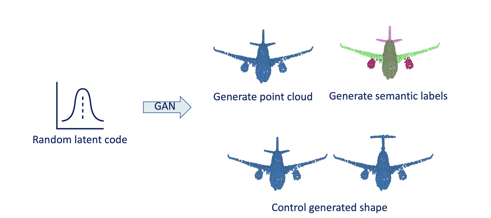
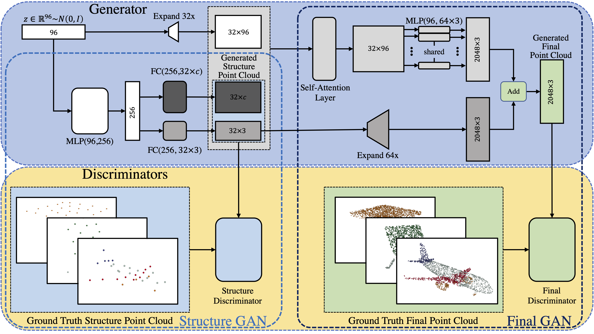

# CPCGAN: A Controllable 3D Point Cloud Generative Adversarial Network with Semantic Label Generating



[[Paper](https://www.aaai.org/AAAI21Papers/AAAI-4341.YangX.pdf)] [[Code](https://github.com/SymenYang/CPCGAN)] [[Poster](https://github.com/SymenYang/CPCGAN/blob/main/ReadmeSrc/Poster.pdf)] [[Video](https://www.bilibili.com/video/BV11y4y1j7u5/)]  
The official code repository for our AAAI 2021 paper *CPCGAN: A Controllable 3D Point Cloud Generative Adversarial Network with Semantic Label Generating*.
## System requirements
Our model has been tested with PyTorch 1.7.0 and CUDA 11.0
## Usage
**Step1** Setup environment
```bash
# Install DLNest
pip install git+https://github.com/SymenYang/DLNest.git
# Install other libs
pip install tensorboard
pip install sklearn
# Set path in config
bash BeforeTrain.sh
```
**Step2** Place the dataset. Please locate the shapenet-partseg dataset as follow:
```
|--CPCGAN
   |--AnalyzeScripts
   |--Datas
      |--train_data
         |--02691156
            |--000001.pts
            |--...
         |--02773838
         |--...
      |--train_label
         |--02691156
            |--000001.seg
            |--...
         |--02773838
         |--...
   |--Dataset
   |--Model
   |--common_config.json
   |--dataset_config.json
   |--freq_config.json
   |--model_config.json
   |--root_config.json
   |--LifeCycle.py
```
**Step3** Preprocess the datas. This may takes 1 or 2 hours due to the K-Means calculations.
```bash
cd DataPreprocessing
bash DataPreprocessing.sh
```
**Step4** Train CPCGAN using DLNest.
```bash
python -m DLNest.Run -c <Absolute path to the root_config.json> -f <Absolute path to the freq_config.json>
```
or run this command in DLNest's shell client:
```
run -c <Absolute path to the root_config.json> -f <Absolute path to the freq_config.json>
```
The configs,backup codes,checkpoints and training outputs will be restored in the `Saves/<A timestamp>` directory.  
More details about DLNest and DLNest-based projects please refer to [DLNest](https://github.com/SymenYang/DLNest) (Only Chinease docs yet.)  
**Step5** Tests  
1. Test in FPD metric.
```bash
python -m DLNest.Analyze -r <Absolute path to the save dir(Saves/<A timestamp>)> -s <Absolute path to AnalyzeScripts/get_FPD.py> -c <The best epoch>>
```
or run these commands in DLNest's shell client:
```
analyze -r <Absolute path to the save dir(Saves/<A timestamp>)>
watch <The task ID of this analyze process>
runExp get_FPD
```
2. Generate a sample.
```bash
python -m DLNest.Analyze -r <Absolute path to the save dir(Saves/<A timestamp>)> -s <Absolute path to AnalyzeScripts/gen_a_sample.py> -c <The best epoch>>
```
or run this command in DLNest's shell client(After analyze process is started in above test):
```
runExp gen_a_sample 
```
3. Control the generation.  
CPCGAN can control the generated shape by modifying the structure point cloud. Please add the modifying codes to the `modify_pc_0` function in `AnalyzeScripts/gen_from_spc_and_z.py`. Then run this command:
```bash
python -m DLNest.Analyze -r <Absolute path to the save dir(Saves/<A timestamp>)> -s <Absolute path to AnalyzeScripts/gen_from_spc_and_z.py> -c <The best epoch>>
```
or run this command in DLNest's shell client(After analyze process is started in above test):
```
runExp gen_from_spc_and_z
```

## Citation
```
@article{Yang_Wu_Zhang_Jin_2021, 
   title={CPCGAN: A Controllable 3D Point Cloud Generative Adversarial Network with Semantic Label Generating}, 
   volume={35}, 
   url={https://ojs.aaai.org/index.php/AAAI/article/view/16425}, 
   number={4}, 
   journal={Proceedings of the AAAI Conference on Artificial Intelligence}, 
   author={Yang, Ximing and Wu, Yuan and Zhang, Kaiyi and Jin, Cheng}, 
   year={2021}, 
   month={May}, 
   pages={3154-3162}
}
```
